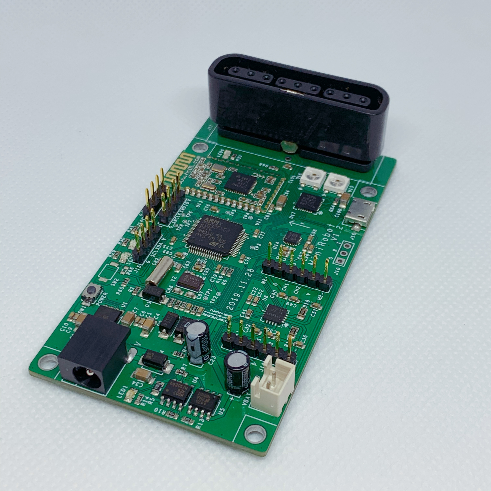

# FreeRTOS demo project
此工程为我小店出售STM32开发板的FreeRTOS示例工程，欢迎[淘宝下单](https://item.taobao.com/item.htm?spm=a2oq0.12575281.0.0.50111debzrd3BZ&ft=t&id=610374072090)  
  

#### 板载资源  
- 主控芯片：STM32F103R8T6  
- BLE4.0蓝牙（型号：广州汇承科技，HC-08）  
- MPU6500 姿态传感器  
- DRV8833 电机驱动（可驱动两路电机）  
- WS2812B 全彩灯珠  
- CP2102 USB转串口  
- PS2遥控接收器插座（注意是有插座，没有接收器和遥控器，需要的话请自行购买）  
- 9V充电接口（推荐充电功率9V2A）  
- 板载指示灯两个（PB4、PB5、蓝红随机）  

